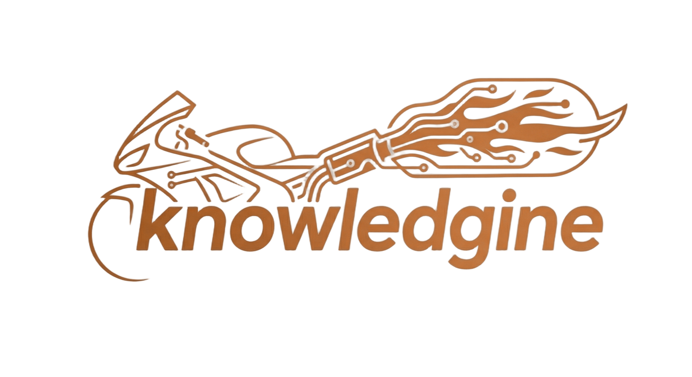

# knowledgine

<p align="center">
  
</p>

Developer Knowledge Infrastructure — extract structured knowledge from your markdown notes for AI coding tools.

[日本語](./docs/README.ja.md)


[](https://www.npmjs.com/package/@knowledgine/cli)


<!-- TODO: Add demo GIF once CLI output is finalized. Record with: vhs docs/assets/demo.tape -->

---

## Why knowledgine?

Developers accumulate valuable knowledge in markdown notes — debugging sessions, architectural decisions, problem-solution pairs, and hard-won lessons. That knowledge stays siloed in files, invisible to AI coding assistants.

knowledgine bridges that gap. It scans your markdown files, detects patterns (problem-solution pairs, code snippets, learnings), and stores them in a local SQLite database with FTS5 full-text search. An MCP server exposes that knowledge to any MCP-compatible AI tool, so your assistant can retrieve the right context exactly when you need it.

- **Local-first** — All data stays in a local SQLite database. No cloud, no API keys.
- **$0 cost** — Embedding model runs locally. No per-query charges.
- **Offline-capable** — Full functionality without network access.
- **MCP native** — Works with Claude Desktop, Cursor, Claude Code out of the box.

---

## Try it now (30 seconds)

```bash
npx @knowledgine/cli init --demo --path /tmp/knowledgine-demo
npx @knowledgine/cli search "React performance" --path /tmp/knowledgine-demo/knowledgine-demo-notes
```

---

## Prerequisites

- **Node.js** >= 18.17.0 (managed via [Volta](https://volta.sh/) or [fnm](https://github.com/Schniz/fnm) recommended)
- **pnpm** >= 9 (for contributing / local builds)
- **Native build tools** for `better-sqlite3`:
  - macOS: `xcode-select --install`
  - Linux (Ubuntu/Debian): `sudo apt-get install build-essential python3`
  - Windows: `npm install --global windows-build-tools`

---

## Quick Start

Three steps from install to working MCP integration.

### 1. Install

```bash
npm install -g @knowledgine/cli
```

### 2. Index your notes

```bash
knowledgine init --path ./my-notes
```

This scans all markdown files and builds `.knowledgine/index.sqlite` with FTS5 full-text search. No model download required.

To enable semantic search (optional, downloads ~23MB model):

```bash
knowledgine init --path ./my-notes --semantic
# or upgrade an existing index:
knowledgine upgrade --semantic --path ./my-notes
```

### 3. Connect your AI tool

```bash
knowledgine setup --target claude-desktop --path ./my-notes
```

This generates the MCP configuration for your AI tool. Add `--write` to write it directly:

```bash
knowledgine setup --target claude-desktop --path ./my-notes --write
```

Restart your AI tool to activate. Verify with:

```bash
knowledgine status --path ./my-notes
```

---

## Commands

| Command    | Description                                                                     |
| ---------- | ------------------------------------------------------------------------------- |
| `init`     | Scan and index markdown files (FTS5 full-text search by default)                |
| `start`    | Start MCP server with file watching for incremental updates                     |
| `setup`    | Generate MCP configuration for AI tools (Claude Desktop, Cursor, Claude Code)   |
| `status`   | Check setup status (database, model, MCP config)                                |
| `upgrade`  | Enable additional capabilities (e.g., semantic search)                          |
| `search`   | Search indexed notes (keyword, semantic, or hybrid mode)                        |
| `capture`  | Capture and manage knowledge snippets from text, URL, or file                   |
| `ingest`   | Ingest knowledge from external sources (Git, GitHub, Obsidian, Claude Sessions) |
| `feedback` | Manage entity extraction feedback (list, apply, dismiss, report)                |
| `plugins`  | Manage ingest plugins (list, status)                                            |
| `tool`     | Execute MCP tools from CLI (search, related, stats, entities)                   |
| `demo`     | Initialize demo environment or clean up demo files                              |

### init

```bash
knowledgine init --path ./my-notes
knowledgine init --path ./my-notes --semantic
```

- `--path <dir>`: Root directory to scan (default: current directory)
- `--semantic`: Enable semantic search (downloads embedding model and generates embeddings)

### upgrade

```bash
knowledgine upgrade --semantic --path ./my-notes
```

- `--semantic`: Download embedding model and generate embeddings for all indexed notes
- `--path <dir>`: Root directory (default: current directory)

### setup

```bash
knowledgine setup --target claude-desktop --path ./my-notes
knowledgine setup --target cursor --path ./my-notes --write
```

- `--target <tool>`: Target AI tool (`claude-desktop`, `cursor`)
- `--path <dir>`: Root directory of indexed notes
- `--write`: Write configuration to file (default: dry-run, shows config only)

### status

```bash
knowledgine status --path ./my-notes
```

Shows database stats, model availability, MCP configuration status, and overall readiness.

### search

```bash
knowledgine search "React performance" --path ./my-notes
knowledgine search "architecture decisions" --mode semantic --path ./my-notes
knowledgine search "debugging tips" --mode hybrid --path ./my-notes --format table
```

- `--mode <mode>`: Search mode (`keyword`, `semantic`, `hybrid`). Default: `keyword`
- `--format <format>`: Output format (`plain`, `table`, `json`). Default: `plain`
- `--limit <n>`: Maximum results. Default: 20
- `--related <noteId>`: Find related notes by note ID
- `--demo`: Search in demo notes

### capture

```bash
knowledgine capture add "TIL: Use React.memo for expensive components" --path ./my-notes
knowledgine capture add --url https://example.com/article --path ./my-notes
knowledgine capture list --path ./my-notes
knowledgine capture delete <id> --path ./my-notes
```

### ingest

```bash
knowledgine ingest --source markdown --path ./my-notes
knowledgine ingest --source github --repo owner/repo --path ./my-notes
knowledgine ingest --source claude-sessions --path ./my-notes
knowledgine ingest --all --path ./my-notes
```

---

## Comparison

| Feature         | knowledgine        | Mem0              | Obsidian Search |
| --------------- | ------------------ | ----------------- | --------------- |
| Cost            | Free (local)       | API costs         | Plugin costs    |
| Data Privacy    | 100% local         | Cloud             | Local           |
| Offline         | Yes                | No                | Yes             |
| AI Integration  | MCP native         | REST API          | Limited         |
| Setup           | 1 command          | Account + API key | App + plugins   |
| Auto-extraction | Patterns, entities | Manual            | Manual          |
| Search          | FTS5 + semantic    | Vector            | Basic text      |

---

## MCP Tools

Once connected, the following tools are available to your AI assistant.

| Tool               | Description                                                                                              | Key Parameters                                                     |
| ------------------ | -------------------------------------------------------------------------------------------------------- | ------------------------------------------------------------------ |
| `search_knowledge` | Full-text search across all indexed notes using FTS5                                                     | `query` (string, required), `limit` (number, optional, default 10) |
| `find_related`     | Find notes related to a given note by tags, title similarity, time proximity, and problem-solution pairs | `notePath` (string, required), `strategies` (array, optional)      |
| `get_stats`        | Retrieve knowledge base statistics (total notes, indexed size, last updated)                             | —                                                                  |
| `search_entities`  | Search knowledge graph entities by name or type                                                          | `query` (string, required), `entityType` (string, optional)        |
| `get_entity_graph` | Get entity with its relationships and linked notes                                                       | `entityName` (string, required)                                    |

---

## MCP Client Setup

### Claude Desktop

Use `knowledgine setup` for automatic configuration, or manually add to `~/Library/Application Support/Claude/claude_desktop_config.json` (macOS) or `~/.config/claude/claude_desktop_config.json` (Linux):

```json
{
  "mcpServers": {
    "knowledgine": {
      "command": "npx",
      "args": ["-y", "@knowledgine/cli", "start", "--path", "/path/to/notes"]
    }
  }
}
```

### Cursor

Use `knowledgine setup --target cursor` for automatic configuration, or manually add to `.cursor/mcp.json` in your project root (recommended) or `~/.cursor/mcp.json` for global use.

Using `${workspaceFolder}` to automatically point to the current project:

```json
{
  "mcpServers": {
    "knowledgine": {
      "command": "npx",
      "args": ["@knowledgine/cli", "start"],
      "env": {
        "KNOWLEDGINE_ROOT_PATH": "${workspaceFolder}"
      }
    }
  }
}
```

For detailed setup instructions, variable expansion reference, and troubleshooting, see the [Cursor Setup Guide](./docs/cursor-setup.md).

---

## Architecture

```
@knowledgine/cli
├── @knowledgine/mcp-server
│   └── @knowledgine/core
├── @knowledgine/ingest
└── @knowledgine/core
```

| Package                   | Description                                                                                                                                                                  |
| ------------------------- | ---------------------------------------------------------------------------------------------------------------------------------------------------------------------------- |
| `@knowledgine/core`       | Knowledge extraction engine. Detects patterns in markdown (problem-solution pairs, code blocks, tags), manages the 3-tier memory model, and provides FTS5 search via SQLite. |
| `@knowledgine/mcp-server` | MCP server that exposes `search_knowledge`, `find_related`, `get_stats`, `search_entities`, and `get_entity_graph` tools to MCP-compatible AI clients.                       |
| `@knowledgine/cli`        | Command-line interface. `init` indexes notes and downloads the embedding model; `setup` configures AI tools; `start` launches the MCP server with file watching.             |
| `@knowledgine/ingest`     | Plugin-based ingestion engine. Collects knowledge from Git history, GitHub, Obsidian, and Claude Sessions.                                                                   |

---

## Configuration

knowledgine uses sensible defaults. You can override them by passing options to `init` or `start`, or by editing the generated config.

| Field            | Default               | Description                                                       |
| ---------------- | --------------------- | ----------------------------------------------------------------- |
| `dataDir`        | `.knowledgine`        | Directory where the SQLite index is stored, relative to `--path`. |
| `watchPatterns`  | `["**/*.md"]`         | Glob patterns for files to index and watch.                       |
| `ignorePatterns` | `["node_modules/**"]` | Glob patterns for files to exclude.                               |

### .knowledginerc.json

Create a `.knowledginerc.json` file in your project root for persistent configuration:

```json
{
  "semantic": true,
  "defaultPath": "./my-notes"
}
```

| Field         | Default | Description                         |
| ------------- | ------- | ----------------------------------- |
| `semantic`    | `false` | Enable semantic search              |
| `defaultPath` | —       | Default `--path` value when omitted |

When `defaultPath` is set, the `--path` option can be omitted from all commands (`init`, `start`, `search`, `ingest`, etc.). `knowledgine init` automatically writes `defaultPath` to `.knowledginerc.json` after the first run.

---

## Troubleshooting

<details>
<summary>Native build failure (better-sqlite3)</summary>

```bash
# macOS
xcode-select --install

# Ubuntu/Debian
sudo apt-get install build-essential python3

# Windows
npm install --global windows-build-tools
```

</details>

<details>
<summary>Embedding model download failure</summary>

If `init --semantic` or `upgrade --semantic` fails to download the model, text search (FTS5) still works. Retry with:

```bash
knowledgine upgrade --semantic --path ./my-notes
```

</details>

<details>
<summary>MCP connection issues</summary>

1. Verify setup: `knowledgine status --path ./my-notes`
2. Re-generate config: `knowledgine setup --target claude-desktop --path ./my-notes --write`
3. Restart your AI tool after writing the config
4. Check that the path in the config matches your notes directory

</details>

---

## Community

- [Bug Reports](https://github.com/3062-in-zamud/knowledgine/issues/new?template=bug_report.yml)
- [Feature Requests](https://github.com/3062-in-zamud/knowledgine/issues/new?template=feature_request.yml)
- [Discussions](https://github.com/3062-in-zamud/knowledgine/discussions)
- [Contributing](./CONTRIBUTING.md)

---

## License

MIT — see [LICENSE](./LICENSE) for details.
